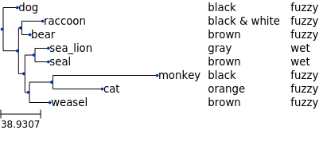
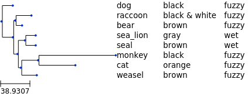

# tree-with-metadata
Draw a phylogenetic tree, along with metadata.

The following tree is taken from the [newick format homepage](https://evolution.genetics.washington.edu/phylip/newicktree.html):

```
((raccoon:19.19959,bear:6.80041):0.84600,((sea_lion:11.99700, seal:12.00300):7.52973,((monkey:100.85930,cat:47.14069):20.59201, weasel:18.87953):2.09460):3.87382,dog:25.46154);
```

The following contrived metadata is used:

```csv
id,color,feel
raccoon,black & white,fuzzy
bear,brown,fuzzy
sea_lion,gray,wet
seal,brown,wet
monkey,black,fuzzy
cat,orange,fuzzy
weasel,brown,fuzzy
dog,black,fuzzy
```



The node labels can optionally be aligned using the `-a` flag:



Note: By default, this script will attempt to re-root the tree on a node named 'Reference'. This is done for compatibility with snippy.
The tree can be rooted on another sample using the `-r` flag.

## Usage

```
usage: tree_with_metadata.py [-h] [-m METADATA] [-r ROOT] [-a] [-o OUTPUT] tree

positional arguments:
  tree

optional arguments:
  -h, --help            show this help message and exit
  -m METADATA, --metadata METADATA
  -r ROOT, --root ROOT
  -a, --align-labels
  -o OUTPUT, --output OUTPUT
```